# Lab5Web

## Belajar Javascript

### Javascript
Pertama, buatlah dokumen html dengan nama file lab4_javascript.html dan tambahkan kode sebagai berikut begini tampilannya :
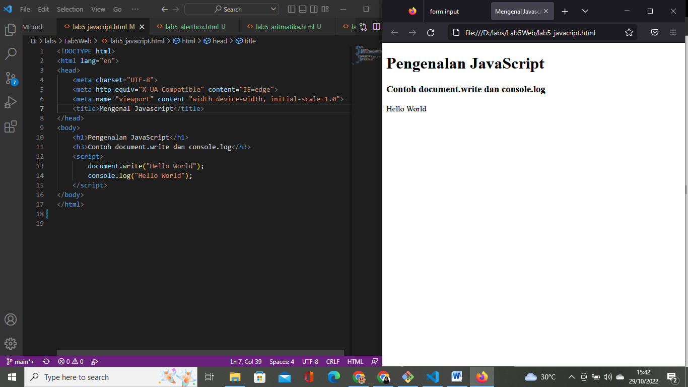

### Alert Box
Menambahkan kode window.alert untuk memunculkan alert box tampilannya seperti ini:
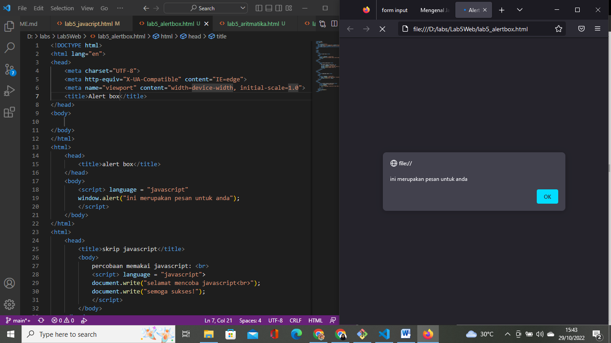

Lalu, memberikan var nama agar bisa menginput nama dan setelah input nama akan keluar nama yg kita input, begini tampilannya:
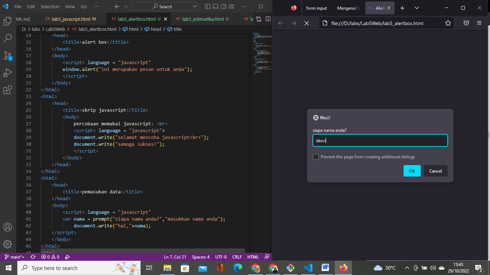
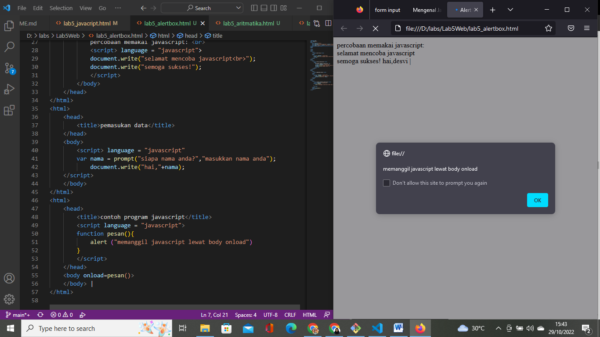

### Operasi Dasar Aritmatika
Masukkan Syntax atau kode tag seperti `<script>`, `<input>`, function dan lain sebagainya. Lalu tambahkan kode untuk perhitungan operasinya seperti penjumlahan, pengurangan, perkalian, pembagian, dan modulus. beginilah tampilannya:
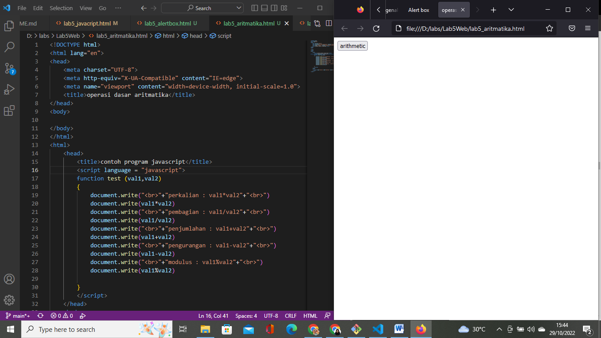
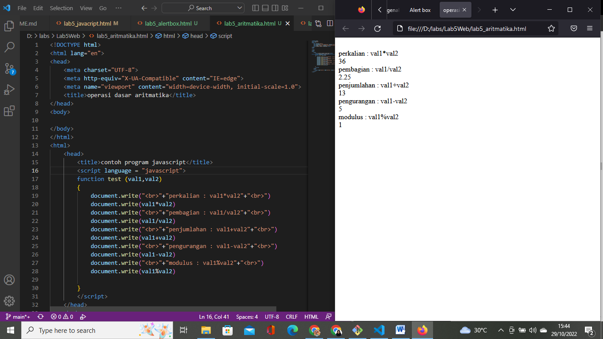

### IF - ELSE
Seleksi kondisi memakai kode if-else dengan tampilan berikut:
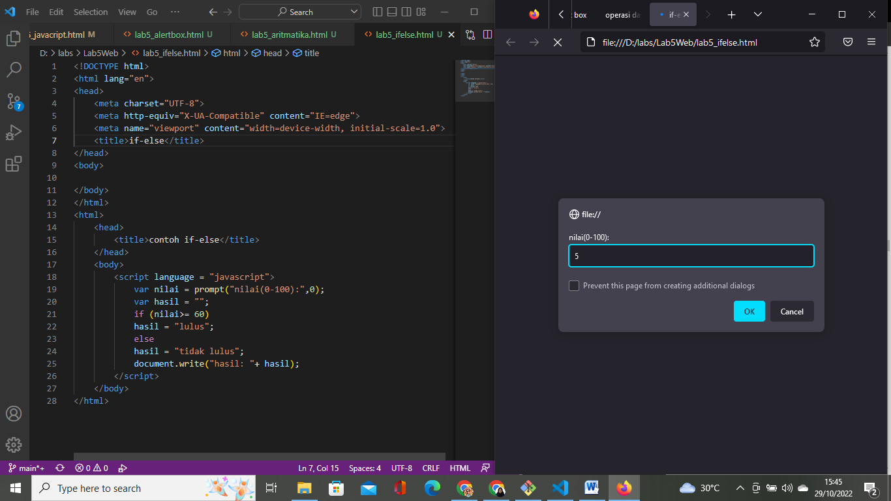

jika kita memasukan angka yang kurang dari 60. Maka, tulisan `tidak lulus` lah yang akan keluar seperti ini:
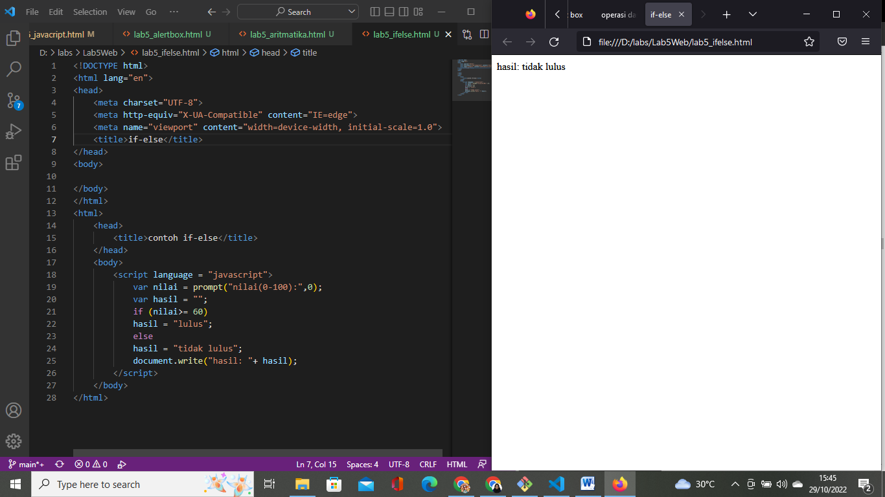

Lalu, jika kita memasukkan angka lebih dari 60. Maka tulisan `lulus` lah yang akan keluar seperti ini:
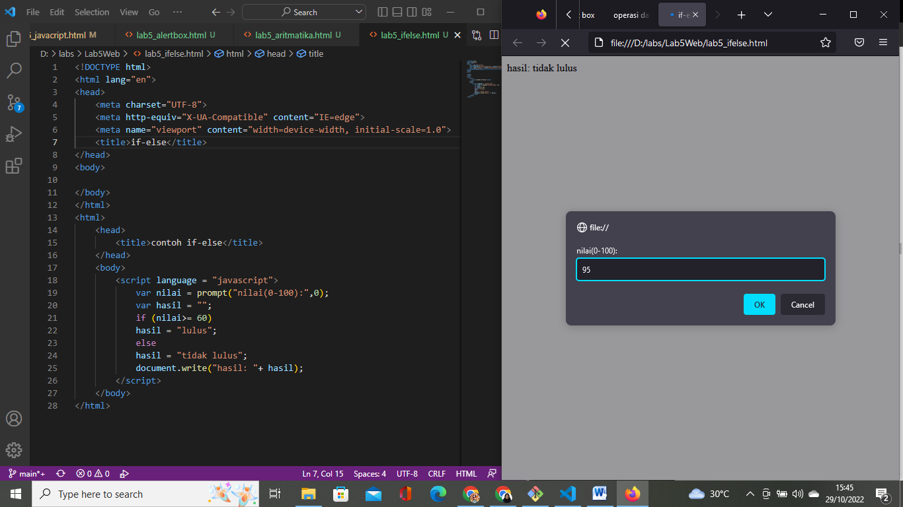

### Operator Switch
Penggunaan operator switch untuk seleksi kondisi beginilah tampilannya:

bila kita memasukkan angka antara 1-5, maka akan keluar tulisan `bilangan satu, dua, tiga, empat, atau lima.` begini tampilannya:
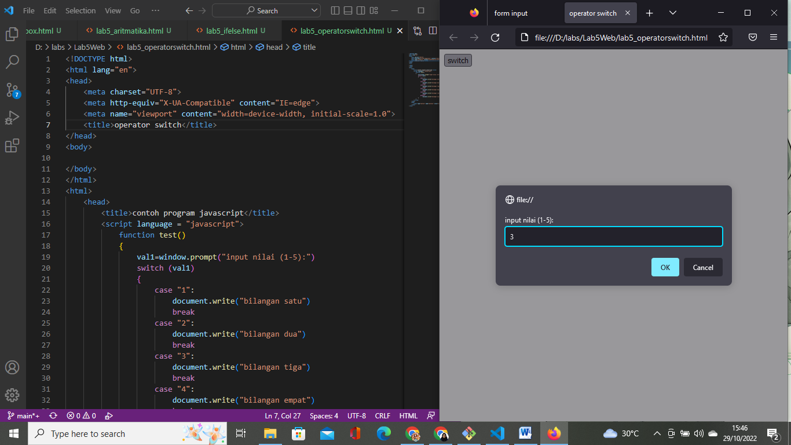
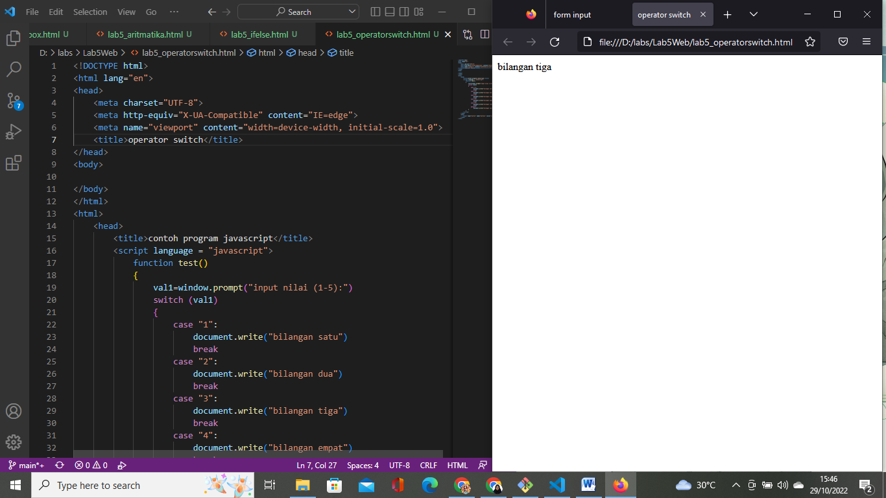

jika kita memasukkan angka selain 1-5 maka akan keluar tulisan `bilangan lainnya`, begini tampilannya:
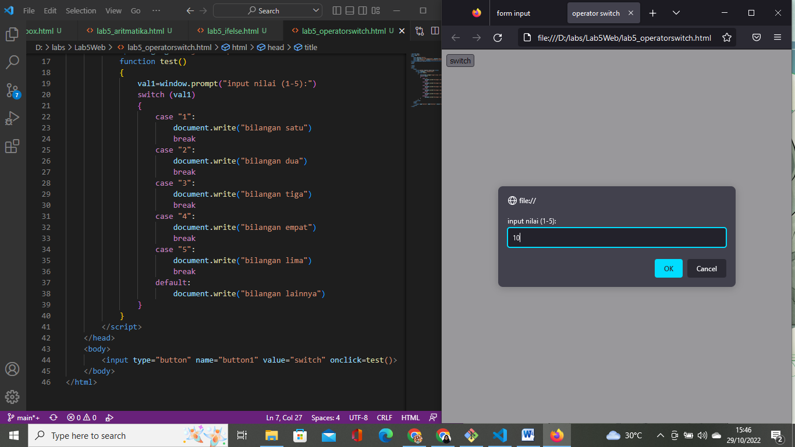
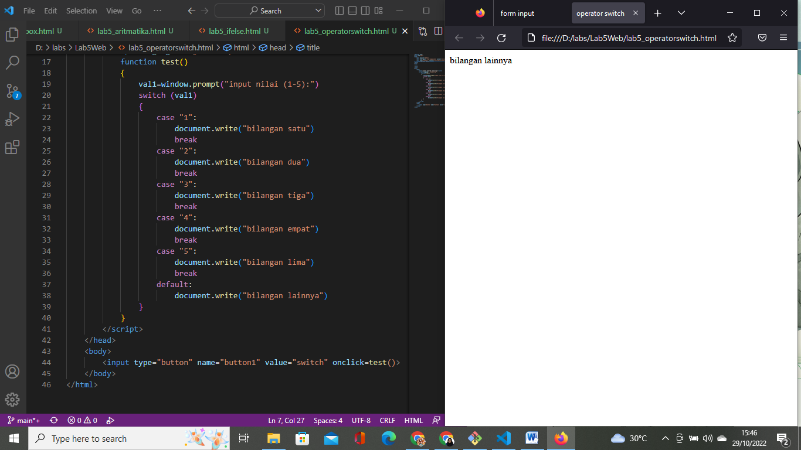

### Membuat Form
Membuat form input dengan menambahkan kode/tag form dengan tampilan berikut:

Membuat form button dengan menambahkan input dengan bentuk button dan menambahkan kode untuk warna, begini penampilannya:
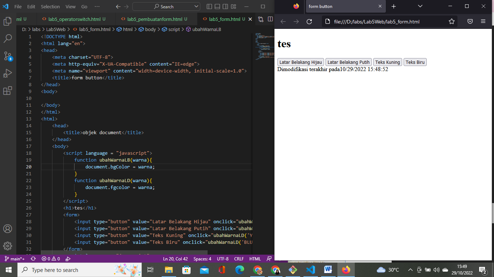
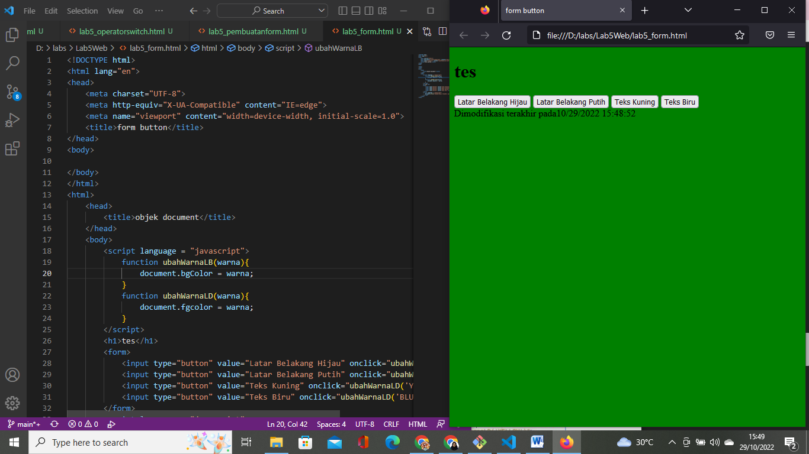

### Checkbox
Membuat atau menggunakan checkbox dengan perhitungan otomatis. begini tampilannya:
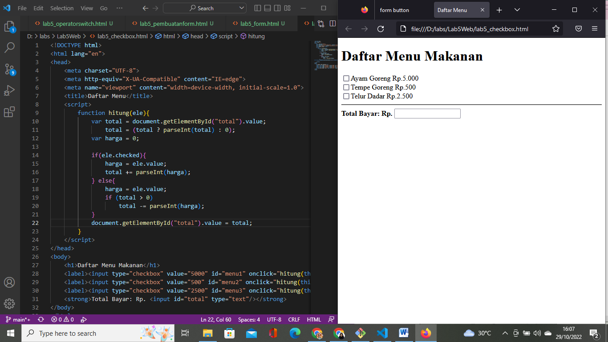
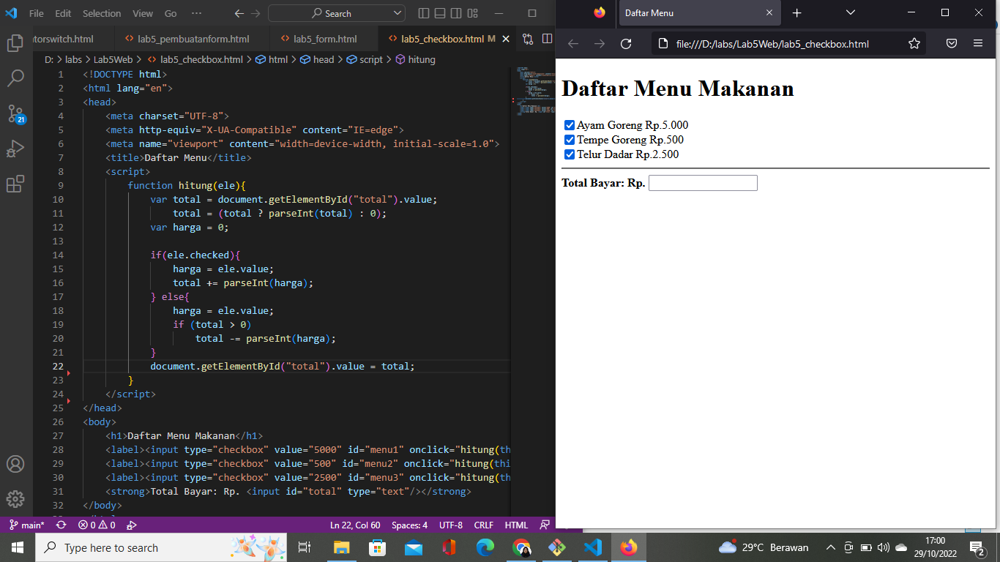
